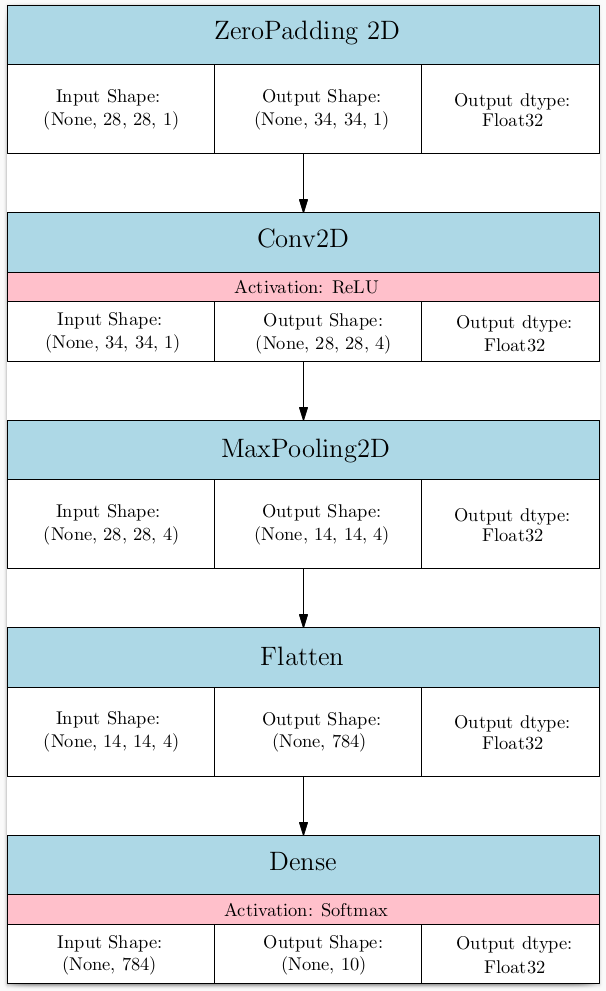
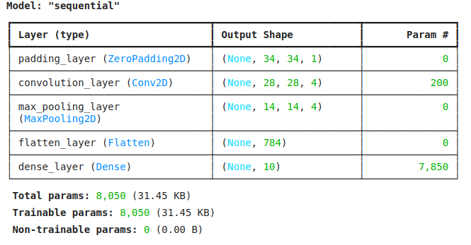
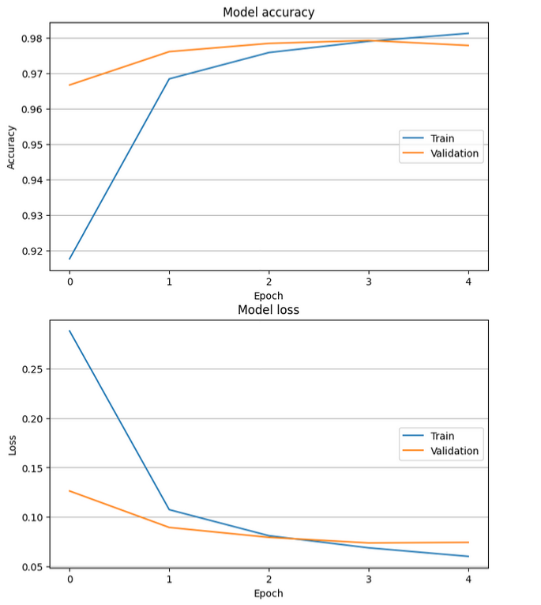
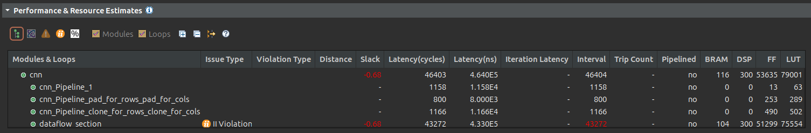
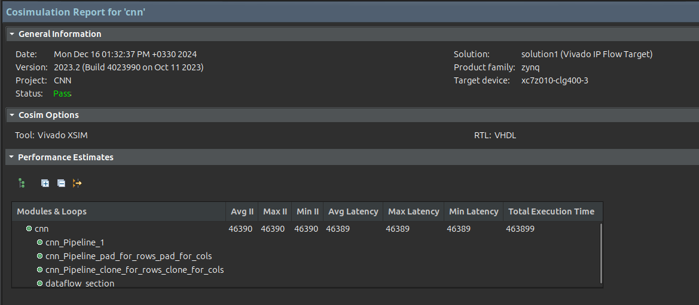
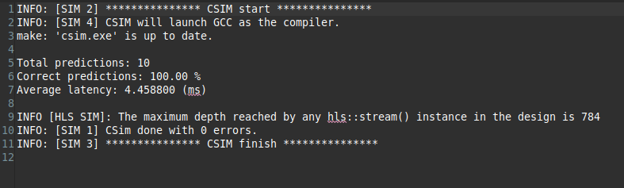

# FPGA-Based Implementation of CNN using High Level Synthesis (HLS)

This repository contains the source files and scripts for implementing a Convolutional Neural Network on FPGA using Vitis High-Level Synthesis (HLS). The design leverages HLS to convert high-level C/C++ descriptions into optimized hardware implementations for FPGAs.

## Features

- High-performance CNN inference on FPGA.
- Implemented using Vitis HLS for efficient synthesis and optimization.
- Modular design for easy modification and integration.


## Implementation

### Training Phase
In the first step, the target network is initially defined in software and trained using the `MNIST` dataset to utilize its weights in the hardware phase. For this purpose, a network with the following architecture is defined:



Define model as bellow in `Codes/SW/utils.py`:
```Python
def define_model() -> Sequential:
   # Define model.
   model = Sequential()
   model.add(ZeroPadding2D(padding=pad, input_shape=(input_size[0], input_size[1], 1), name="padding_layer"))
   model.add(Conv2D(conv_filter_num, conv_kernel_size, activation="relu", padding="valid", kernel_initializer="he_uniform", input_shape=(30, 30, 1), name="convolution_layer"))
   model.add(MaxPooling2D(pool_size, name="max_pooling_layer"))
   model.add(Flatten(name="flatten_layer"))
   model.add(Dense(10, activation="softmax", name="dense_layer"))
   # Compile model.
   model.compile(optimizer=Adam(), loss="categorical_crossentropy", metrics=["accuracy"])
   # Return model.
   return model
```

The output of the network after compiling it:



After defining the network structure and training it on the MNIST dataset for 5 epochs, the following results were obtained:



1. Network Accuracy:
   - Accuracy on the training data: 0.9817
   - Accuracy on the test data: 0.9801
2. Inference Time:
   - 46.8072 milliseconds for 100 complete samples.
  
Finally, all the weights and parameters required for the hardware phase were stored in the following three files:
- ‍`conv_weights.h`: Contains the weights of the convolutional layers.
- `dense_weights.h`: Contains the weights of the fully connected layer.
- `definitions.h`: Includes certain constants used in the hardware phase.


Additionally, all the `MNIST` test data, including the images and their corresponding labels, were saved in two files:

- `in.dat`: Contains the input data.
- `out.dat`: Contains the corresponding labels.

This two file generated in `Codes/SW/gen_data.ipynb` file.


### Inference Phase
In this phase, it is necessary to write the code for the Convolutional layer and Fully Connected layer and other important modules. The same structure presented in the software phase will be implemented in the hardware phase.

The hardware implementation is carried out here, while the structure defined in the software phase is maintained. The code for the Fully Connected layer is provided as follows:

```C
void dense(hls::stream<float> & flat_to_dense_stream, int filter, hls::stream<float> & dense_to_softmax_stream)
{
  float flat_value;
  float dense_array[DENSE_SIZE] = { 0 };

  dense_for_flat:
  for (int i = 0; i < FLAT_SIZE / FILTERS; ++i)
  {
    flat_value = flat_to_dense_stream.read();

    for (int d = 0; d < DENSE_SIZE; ++d)
    {
      int index = filter * (FLAT_SIZE / FILTERS) + i;
        dense_array[d] += dense_weights[index][d] * flat_value;
    }
  }

  for (int j = 0; j < DENSE_SIZE; ++j)
  {
    dense_to_softmax_stream.write(dense_array[j]);
  }
}
```


In this design, the Convolutional Layer 4 has been utilized as follows:

```C
void convolutional_layer(
	  float pad_img0 [PAD_IMG_ROWS][PAD_IMG_COLS],
	  float pad_img1 [PAD_IMG_ROWS][PAD_IMG_COLS],
	  float pad_img2 [PAD_IMG_ROWS][PAD_IMG_COLS],
	  float pad_img3 [PAD_IMG_ROWS][PAD_IMG_COLS],
	  hls::stream<float> conv_to_pool_streams [FILTERS] )
{
  convolution(pad_img0, 0, conv_to_pool_streams[0]);
  convolution(pad_img1, 1, conv_to_pool_streams[1]);
  convolution(pad_img2, 2, conv_to_pool_streams[2]);
  convolution(pad_img3, 3, conv_to_pool_streams[3]);
}
```

The output of the Convolutional Layers has been mapped to a Feature Map, which has then been flattened for further processing. The definition of this process is as follows:

```C
void flattening(hls::stream<float> &  pool_to_flat_stream, hls::stream<float> &  flat_to_dense_stream)
{
  flat_for_rows:
  for(int r = 0; r < POOL_IMG_ROWS; ++r)
  {
    flat_for_cols:
    for(int c = 0; c < POOL_IMG_COLS; ++c)
    {
      flat_to_dense_stream.write(pool_to_flat_stream.read());
    }
  }
}
```


The final design of the model is referred to as the CNN. The definition of this model is as follows:

```C
void cnn(float img_in[IMG_ROWS][IMG_COLS], float prediction[DIGITS])
{
  /******** Pre-processing data. ********/

  float pad_img0 [PAD_IMG_ROWS][PAD_IMG_COLS] = { 0 };
  normalization_and_padding(img_in, pad_img0);

  #if 0
    #ifndef __SYNTHESIS__
      printf("Padded image.\n");
      print_pad_img(pad_img);
    #endif
  #endif

  /* Allow parallelism cloning the padded image. */
  float pad_img1 [PAD_IMG_ROWS][PAD_IMG_COLS];
  float pad_img2 [PAD_IMG_ROWS][PAD_IMG_COLS];
  float pad_img3 [PAD_IMG_ROWS][PAD_IMG_COLS];

  float value;

  clone_for_rows:
  for(int i = 0; i < PAD_IMG_ROWS; ++i)
    clone_for_cols:
	for(int j = 0; j < PAD_IMG_COLS; ++j)
    {
      pad_img1[i][j] = pad_img0[i][j];
      pad_img2[i][j] = pad_img0[i][j];
      pad_img3[i][j] = pad_img0[i][j];
    }

  /* Parallel executions start here. */
  dataflow_section(pad_img0, pad_img1, pad_img2, pad_img3, prediction);
}
```


## Synthesis Results
In the final stage, we synthesize the CNN model. The network synthesis reports are provided as follows:






## Testbench
In the final stage, a testbench file has been written for the design, which processes 100 initial images from the `in.dat` file generated in the previous phase. These images are then passed to the network for processing. The network output includes the accuracy of number recognition and the time consumed for the entire process.

For example, our model recognizes 100 initial images from the MNIST test dataset with 100% accuracy.





## Getting Started

### Prerequisites

Make sure you have the following tools installed on your system:

- [Xilinx Vitis HLS](https://www.xilinx.com/products/design-tools/vitis.html)
- A compatible Xilinx FPGA development board. (I use [Digilent Zedboard](https://digilent.com/reference/programmable-logic/zedboard/start?srsltid=AfmBOopD31UhpS6JNzArP7-XzqL7dpQ8sG8Q0-w0Np0Z0SEVcadnrD-7))

### Clone the Repository

Clone this repository to your local machine:

```bash
git clone https://github.com/rezaAdinepour/CNN-on-FPGA.git
cd CNN-on-FPGA
```

## Project Structure

The repository is organized as follows:
```
cnn-fpga-vitis-hls/
├── HW/                     # Hardware implementation files
│   └── src/                
│       ├── Data/           
│       ├── cnn.cpp         
│       └── cnn.h           
├── SW/                     # Software implementation files
│   ├── Data/
│   ├── Header/
│   ├── Model/ 
│   ├── gen_data.ipynb      
│   ├── train.ipynb         
│   └── utils.py            
└── Makefile
```

## Creating the Project in Vitis HLS

1. Open **Vitis HLS**.
2. Create a new project:
   - **Project Name**: Choose a name for your project.
   - **Project Directory**: Set the directory where you want the project files to be stored.
3. Add the source files:
   - Copy the contents of the `HW/src/` directory into the `src/` directory of your project.
   - Add the source files to your Vitis HLS project.
4. Set the top function:
   - Specify the top-level function for synthesis.
5. Configure synthesis settings:
   - Optimize for latency, throughput, or area based on your requirements.
  

## Building the Project

After setting up the project:

1. Run **C Simulation** to verify the functionality of the design.
2. Perform **Synthesis** to generate the RTL design.
3. Use **C/RTL Co-Simulation** to validate the synthesized RTL against the C model.
4. Export the IP core or generate the bitstream for deployment on FPGA.

## Additional Notes

- Modify the `HW/src/` files to customize the CNN hardware implementation.
- Use the provided Python scripts in the `SW/` folder for training the model and generating data.
- You can find the trained model in the `Model/` folder.
- Refer to the Vitis HLS documentation for advanced optimization techniques.

